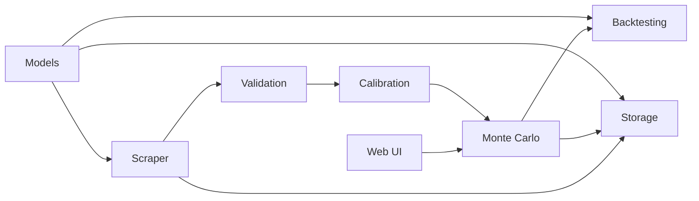

# Architecture

The project is organized as small packages under `portfolio/`, each owning one part of the portfolio tracking workflow.

## Packages

- `models`: shared domain types such as assets, candles, portfolios, and simulation results.
- `scraper`: market data interfaces and Yahoo Finance implementation.
- `validation`: quality checks before calibration.
- `calibration`: historical parameter estimation and feedback adjustment.
- `montecarlo`: GBM simulation engine.
- `rolling`: walk-forward window splitting and optimization.
- `backtesting`: metrics and forecast comparison.
- `storage`: persistence interface and in-memory implementation.
- `web`: embedded web interface and JSON API.

The CLI in `cmd/` wires these pieces into demo, fetch, and web server flows.
