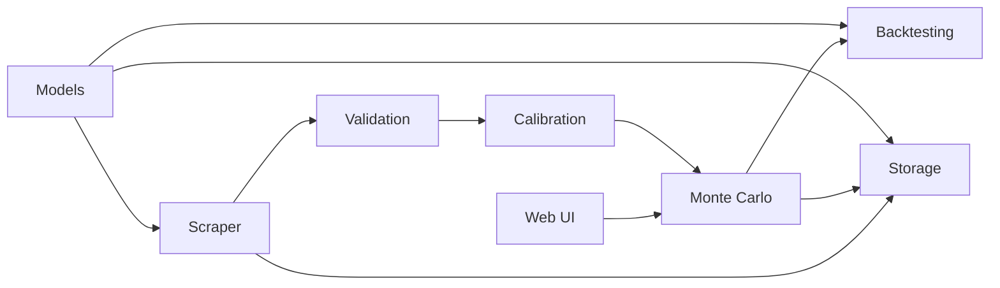

# Architecture

**The project is organized as small, focused packages under `portfolio/`, each owning one stage of the portfolio tracking workflow.**

---

## Data Flow

---

## Packages

| Package | Responsibility |
| --- | --- |
| `models` | Shared domain types: assets, candles, portfolios, simulation results |
| `scraper` | Market data interfaces and Yahoo Finance implementation |
| `validation` | Quality checks before calibration |
| `calibration` | Historical parameter estimation and feedback adjustment |
| `montecarlo` | GBM simulation engine |
| `rolling` | Walk-forward window splitting and optimization |
| `backtesting` | Metrics and forecast comparison |
| `storage` | Persistence interface and in-memory implementation |
| `web` | Embedded web interface and JSON API |

---

## Entry Point

The CLI in `cmd/` wires these packages into three flows:

- **`demo`** runs a Monte Carlo simulation directly in the terminal
- **`fetch`** pulls Yahoo Finance data, validates, and calibrates parameters
- **`web`** starts the embedded HTTP server with the simulation UI
